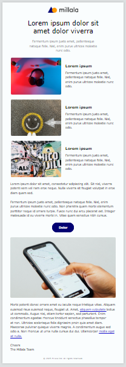

# Email Template

Responsive HTML email layout created as a practice project for learning table-based design and inline styles.

🔗 **Live preview**: [View on GitHub Pages](https://olehouseproduction.github.io/email-template/)

---

## 📸 Preview

---

## ✨ Features

- Table-based layout for compatibility with most email clients
- Inline CSS styling
- Responsive structure
- Basic content layout with images, text and button

---

## 📂 Project structure

- `index.html` — main email template
- `screenshot.png` — preview image

---

## 📚 Learning goals

- Build email-friendly HTML using tables
- Understand how email clients interpret styles
- Practice inline styling and responsive patterns
